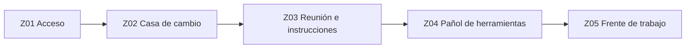
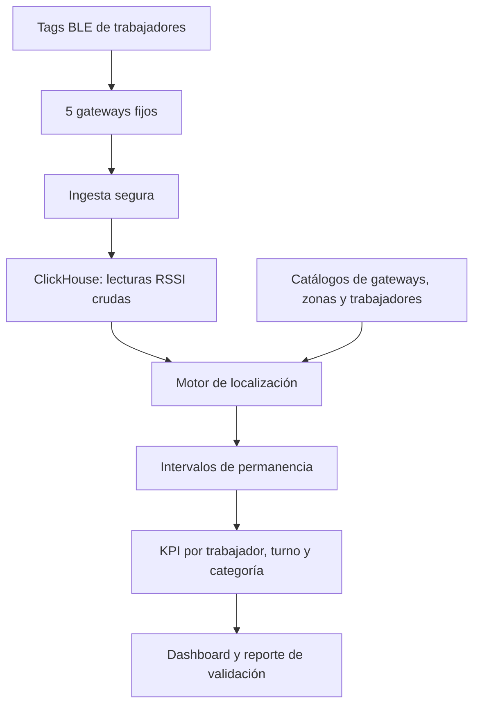

# PROTEGE — piloto simulado Time on Tools

Diseño de referencia para medir la permanencia de trabajadores en zonas de una
faena simulada mediante tags BLE y gateways (scanners) fijos.

## Objetivo

Transformar detecciones BLE (`timestamp`, gateway, tag y RSSI) en una línea de
tiempo por trabajador y, desde ella, calcular:

- tiempo productivo en el frente de trabajo;
- tiempo de acceso y salida;
- tiempo en casa de cambio;
- tiempo asociado a instrucciones/reuniones;
- tiempo asociado al pañol o espera de herramientas;
- tiempo sin ubicación confiable;
- tiempo total de permanencia en faena.

La ubicación es una **inferencia probabilística**. La presencia en la zona de
reunión o pañol no demuestra por sí sola que hubo espera; para un KPI contractual
debe cruzarse con órdenes de trabajo, agenda de charlas o eventos del supervisor.

## Layout imaginario



| Zona | Gateway | Propósito | Clasificación inicial |
| --- | --- | --- | --- |
| Z01 Acceso | GW-ACCESS-01 | Entrada/salida y límite de turno | soporte |
| Z02 Casa de cambio | GW-CHANGE-01 | Cambio de ropa/EPP | no productivo planificado |
| Z03 Reunión | GW-BRIEF-01 | Charla, asignación e instrucciones | no productivo planificado |
| Z04 Herramientas | GW-TOOLS-01 | Retiro/devolución y espera | no productivo inferido |
| Z05 Frente de trabajo | GW-WORK-01 | Ejecución de la tarea | productivo |

Para separar espacios colindantes conviene instalar un gateway por zona, lejos
de tabiques metálicos, registrar coordenadas y altura, y ejecutar una campaña de
calibración con el tag en el pecho/casco en puntos conocidos. Si una zona es
grande o tiene sombra RF, se agregan scanners adicionales con el mismo `zone_id`.

## Arquitectura



Cada lectura debe contener `event_time`, `gateway_address`, `tag_address`,
`rssi_dbm`, contador de secuencia y estado del gateway. La identidad del
trabajador se mantiene en un catálogo separado. El dashboard no necesita exponer
la dirección BLE; puede trabajar con `worker_id` pseudonimizado.

## Lógica de ubicación RSSI

1. Normalizar direcciones BLE a mayúsculas.
2. Agrupar lecturas por trabajador en ventanas de 5 s.
3. Calcular la mediana RSSI por zona; la mediana reduce picos y multipath.
4. Elegir la zona con mejor RSSI si supera `min_rssi_dbm` (inicio: -85 dBm).
5. Mantener la zona actual mientras el candidato no sea al menos 6 dB mejor.
6. Confirmar un cambio sólo después de 3 ventanas consecutivas (15 s).
7. Si no hay lectura válida durante 30 s, cerrar el intervalo y marcar
   `UNKNOWN`; no distribuir artificialmente ese tiempo.
8. Unir huecos menores de 15 s si antes y después aparece la misma zona.

Los valores son parámetros iniciales; deben calibrarse con recorridos reales y
una matriz de confusión por zona. Para el piloto, la meta razonable es ≥90 % de
exactitud de zona y error absoluto mediano ≤30 s por permanencia.

## Definición inicial de KPI

Sea el turno observado desde la primera detección válida de entrada hasta la
última detección válida de salida:

`T_presencia = T_salida - T_entrada`

`T_productivo = suma(intervalos en Z05)`

`T_no_productivo = T_cambio + T_instrucciones + T_herramientas`

`T_no_clasificado = T_presencia - T_productivo - T_no_productivo - T_soporte`

`Time on Tools (%) = 100 × T_productivo / T_presencia`

También debe informarse cobertura:

`Cobertura (%) = 100 × (T_presencia - T_no_clasificado) / T_presencia`

No se debe presentar Time on Tools sin cobertura, porque una pérdida de señal
podría mejorar o empeorar artificialmente el indicador.

## Archivos

- `sql/001_schema.sql`: tablas de catálogos, lecturas e intervalos.
- `sql/002_seed_simulated_site.sql`: zonas, gateways y trabajadores ficticios.
- `sql/003_kpi_views.sql`: vista diaria de tiempos y porcentajes.
- `src/simulate_protege.py`: genera un recorrido BLE reproducible.
- `src/infer_zones.py`: referencia del algoritmo de permanencia.
- `tests/test_infer_zones.py`: pruebas unitarias básicas.

## Ejecución local

```bash
python3 src/simulate_protege.py --output sample_data/scans.csv
python3 src/infer_zones.py \
  --scans sample_data/scans.csv \
  --gateways sample_data/gateways.csv \
  --output sample_data/intervals.csv
python3 -m unittest discover -s tests -v
```

La simulación sólo valida la lógica. Antes del despliegue se deben validar
privacidad, consentimiento, retención de datos, seguridad de transporte y reglas
laborales aplicables.

## Plan de validación

1. Marcar 10–15 puntos de prueba y medir 2 minutos por punto.
2. Hacer al menos 20 recorridos con horario anotado o video de referencia.
3. Ajustar umbral, histéresis y permanencia mínima sin usar los recorridos de
   evaluación final.
4. Comparar zona inferida contra zona real y reportar matriz de confusión.
5. Ejecutar 3–5 jornadas simuladas con varios tags y tráfico normal.
6. Congelar parámetros antes de medir los KPI del piloto.

